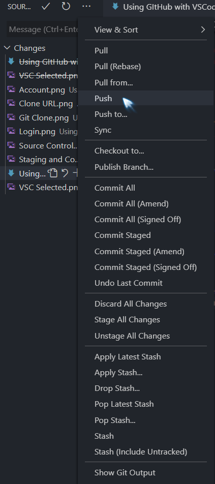

## Using Git with VSCode
At first, I thought this was going to be difficult. But I managed to get everything set up within 5 minutes. These are the steps I followed to set up Git to pull and push any repositories and changes!

### Download Git
The first step is to, of course, download [Git](https://git-scm.com/downloads). Get the appropriate version for your operating system and set it up. During installation, you will be asked to choose the default editor used by Git. At this stage, you will want to select Visual Studio Code as Git's default editor.


### Setting up Git
You will need perform some initial set up for Git. If you do not perform this step, you will not be able to use Git with VS Code. Open up the Git Bash program. You will see a terminal. In it, enter the following commands:

```
git config --global user.name "yourusername"
git config --global user.email youremail@email.com
```
That's all there is to setting up Git!

### Preparing Visual Studio Code
Head to the extensions segment in VSC and search for **Github Pull Requests**. Install it, then reload VSC. Open the command palette using Ctrl+Shift+P and type git clone and select it. 


It should request the URL of your GitHub repository and once entered, it will clone the folder into your computer.


When it has successfully downloaded, you can choose to open the folder. That's it - you have just successfully cloned your repository from GitHub!

### Committing Changes
Before you can commit any changes to GitHub, you will need to login and authenticate VSCode to use Git. At the bottom left corner of your VSCode, click on your account logo. 


It should bring up the GitHub login page. Login with your credentials and it will automatically authenticate VSCode to use Git.


You are now ready to commit any changes you have made to your repository! Click the icon under the search menu for Source Control.


Upon entering it, you should see the changes that you have made to your files. You can choose to stage specific changes, or stage and commit all of them by pressing the Tick symbol and pressing Yes or Always on the pop up.


Once you have committed all your changes, all that's left to do is to push them to your repository! You can easily do so by pressing the menu button and selecting push.

